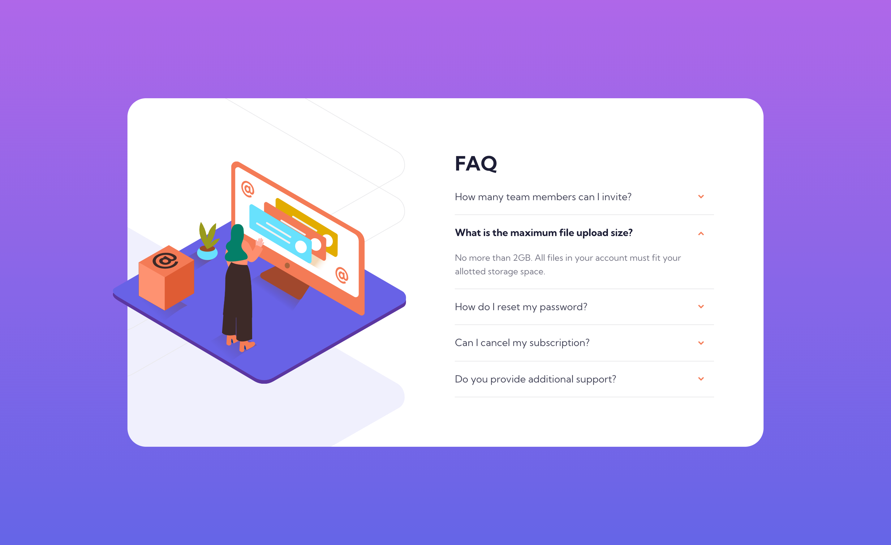

# Frontend Mentor - FAQ accordion card solution

This is a solution to the [FAQ accordion card challenge on Frontend Mentor](https://www.frontendmentor.io/challenges/faq-accordion-card-XlyjD0Oam) by using Vue 3.

Frontend Mentor challenges help you improve your coding skills by building realistic projects.

## Table of contents

- [Overview](#overview)
  - [The challenge](#the-challenge)
  - [Screenshot](#screenshot)
- [My process](#my-process)
  - [Built with](#built-with)
  - [What I learned](#what-i-learned)
  - [Continued development](#continued-development)
  - [Useful resources](#useful-resources)
- [Author](#author)
<!-- - [Acknowledgments](#acknowledgments) -->

## Overview

### The challenge

Users should be able to:

- View the optimal layout for the component depending on their device's screen size
- See hover states for all interactive elements on the page
- Hide/Show the answer to a question when the question is clicked

### Screenshot



## My process

### Built with

- [Vue 3](https://vuejs.org/) - The Progressive JavaScript Framework
- Flexbox
- Components
- Conditional Rendering
- Computed Properties
- CSS Style Bindings

### What I learned

- When dealing with `srcset` tag using ***.svg*** image file, the svg need to specified the `width` & `height` attributes in order to show on the DOM...! The provided resource's mobile version svg image did not..., took me awhile to figure it out.

- CSS Style Bindings:

```js
let qColor = computed(() => isOpen ? "hsl(238, 29%, 16%)" : "hsl(237, 12%, 33%)");
let fontWeight = computed(() => isOpen ? "700" : "400");
```

```html
<p id="question">
  {{ question }}
  <ArrowUp v-if="isOpen" />
  <ArrowDown v-else />
</p>
```

```css
#question {
  /* ... */
  color: v-bind(qColor);
  font-weight: v-bind(fontWeight);
}
```

### Continued development

- ``: Need to look into how to manage different `srcset` & how to style it?!
- CSS background-img related style methods?!

### Useful resources

- [Vue.js Official Doc](https://vuejs.org/api/sfc-css-features.html#v-bind-in-css) - `v-bind()` in CSS

## Author

- Website - [JLDev](https://jacoblindev.github.io/vue-fm-challenges/)
- Frontend Mentor - [@jacoblindev](https://www.frontendmentor.io/profile/jacoblindev)
- Instagram - [@jacoblindev](https://www.instagram.com/jacoblindev/)
- Twitter - [@Jacob20840321](https://twitter.com/Jacob20840321)

<!-- ## Acknowledgments

This is where you can give a hat tip to anyone who helped you out on this project. Perhaps you worked in a team or got some inspiration from someone else's solution. This is the perfect place to give them some credit. -->
